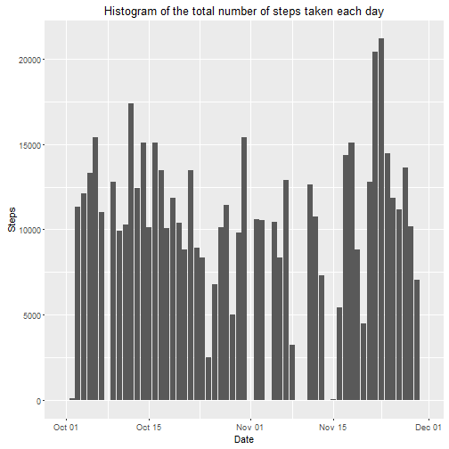
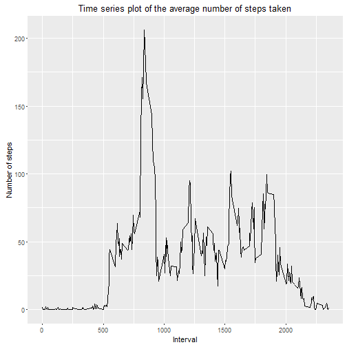
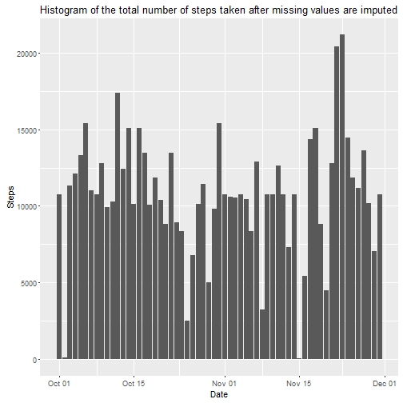
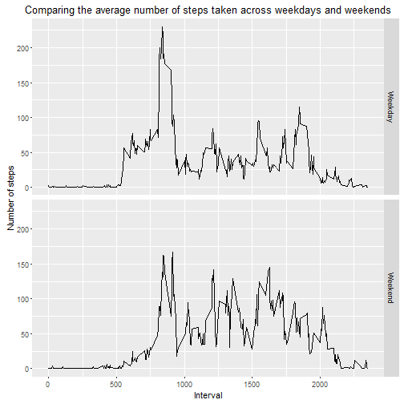

## Introduction

This assignment makes use of data from a personal activity monitoring
device. This device collects data at 5 minute intervals through out the
day. The data consists of two months of data from an anonymous
individual collected during the months of October and November, 2012
and include the number of steps taken in 5 minute intervals each day.


## Data

The data for this assignment can be downloaded from the course web
site:

* Dataset: [Activity monitoring data]
(https://d396qusza40orc.cloudfront.net/repdata%2Fdata%2Factivity.zip) [52K]

The variables included in this dataset are:

* **steps**: Number of steps taking in a 5-minute interval (missing
    values are coded as `NA`)

* **date**: The date on which the measurement was taken in YYYY-MM-DD
    format

* **interval**: Identifier for the 5-minute interval in which
    measurement was taken


The dataset is stored in a comma-separated-value (CSV) file and there
are a total of 17,568 observations in this
dataset.


## Loading and preprocessing the data

Manualy download dateset from the web site, unpack and put `activity.csv` file 
into work directory.

Load data from CSV file: 


```r
actvt <- read.csv("activity.csv")
```

Convert date from character representations YYYY-MM-DD format in objects of 
class "Date":


```r
actvt$date <- as.Date(actvt$date,"%Y-%m-%d")
```


## What is mean total number of steps taken per day?

For this part of the assignment ignore the missing values in the dataset.

Calculate the total number of steps taken per day and put it into `spd` object 
(abbreviation for **S**teps **P**er **D**ay):


```r
spd <- aggregate(actvt$step, list(date = actvt$date), sum, na.rm = TRUE)
```

Make a histogram of the total number of steps taken each day:


```r
library(ggplot2)
ggplot(spd, aes(x = date, y = x)) + 
    geom_bar(stat = "identity") +
    labs(x = "Date") +
    labs(y = "Steps") +
    labs(title = "Histogram of the total number of steps taken each day")
```



Calculate and report the mean and median of the total number of steps taken per day:


```r
spd_mean <- mean(spd$x)
spd_median <- median(spd$x)
print(paste(
    "Mean of the total number of steps taken per day:", 
    round(spd_mean, digits = 2)))
```

```
## [1] "Mean of the total number of steps taken per day: 9354.23"
```

```r
print(paste(
    "Median of the total number of steps taken per day:",
    round(spd_median, digits = 2)))
```

```
## [1] "Median of the total number of steps taken per day: 10395"
```


## What is the average daily activity pattern?

Calculate the average number of steps taken per interval across all days and put
it into `aspi` object (abbreviation for **A**verage **S**teps **P**er **I**nterval):


```r
aspi <- aggregate(actvt$step, list(interval = actvt$interval), mean, na.rm = TRUE)
```

Make a time series plot of the 5-minute interval (x-axis) and the average number
of steps taken, averaged across all days (y-axis):


```r
ggplot(aspi, aes(x = interval, y = x)) + 
    geom_line() +
    labs(x = "Interval") +
    labs(y = "Number of steps") +
    labs(title = "Time series plot of the average number of steps taken")
```



Calculate 5-minute interal, on average across all the days in the dataset, 
contains the maximum number of steps:


```r
max_steps_interval <- aspi[which.max(aspi$x), "interval"]
print(paste(
    "Interval contains the maximum number of steps on average across all the days:",
    max_steps_interval))
```

```
## [1] "Interval contains the maximum number of steps on average across all the days: 835"
```


## Imputing missing values

Calculate and report the total number of missing values in the dataset (i.e. the
total number of rows with NAs):


```r
na_count <- sum(is.na(actvt$steps))
print(paste(
    "The total number of missing values in the dataset:", 
    na_count))
```

```
## [1] "The total number of missing values in the dataset: 2304"
```

**The strategy for filling in all of the missing values in the dataset:** Use
the mean for that 5-minute interval across all the days for filling the missing 
values.

Create a dataset that is equal to the original dataset but with the missing data 
filled in and put it into `actvt_fmv` object:


```r
actvt_int <- split(actvt, actvt$interval)
actvt_int_fmv <- lapply(actvt_int, function (x) { x$steps[is.na(x$steps)] = mean(x$steps, na.rm=TRUE) ; x} )
actvt_fmv <- unsplit(actvt_int_fmv, actvt$interval)
```

Calculate the total number of steps taken per day and put it into `spd_fmv`
object:


```r
spd_fmv <- aggregate(actvt_fmv$step, list(date = actvt_fmv$date), sum, na.rm = TRUE)
```

Make a histogram of the total number of steps taken each day:


```r
ggplot(spd_fmv, aes(x = date, y = x)) + 
    geom_bar(stat = "identity") +
    labs(x = "Date") +
    labs(y = "Steps") +
    labs(title = "Histogram of the total number of steps taken after missing values are imputed")
```



Calculate and report the mean and median of the total number of steps taken per day:


```r
spd_fmv_mean <- mean(spd_fmv$x)
spd_fmv_median <- median(spd_fmv$x)
print(paste(
    "Mean of the total number of steps taken per day after imputing missing values:", 
    round(spd_fmv_mean, digits = 2)))
```

```
## [1] "Mean of the total number of steps taken per day after imputing missing values: 10766.19"
```

```r
print(paste(
    "Median of the total number of steps taken per day after imputing missing values:", 
    round(spd_fmv_median, digits = 2)))
```

```
## [1] "Median of the total number of steps taken per day after imputing missing values: 10766.19"
```

The mean and median of the total number of steps taken per day is greater than 
from the estimates from the first part of the assignment.

Function `aggregate` produce 0 value for days there all interval is NA. This
impact on calculation the mean and median.


## Are there differences in activity patterns between weekdays and weekends?

Use the dataset with the filled-in missing values for this part.

Create a new factor variable `pw` in the dataset with two levels – “weekday” and
“weekend” indicating whether a given date is a weekday or weekend day and put
it into `actvt_fmv` object: 


```r
actvt_fmv$pw <- as.factor(ifelse(weekdays(actvt_fmv$date) %in% 
                                        c("Saturday", "Sunday"),
                                       "Weekend", "Weekday"))
```

Calculate the average number of steps taken per interval across all weekday days 
or weekend days and put it into `aspipw` object:


```r
aspipw <- aggregate(actvt_fmv$step, 
               list(interval = actvt_fmv$interval, pw = actvt_fmv$pw), 
               mean, na.rm = TRUE)
```

Make a panel plot containing a time series plot of the 5-minute interval
(x-axis) and the average number of steps taken, averaged across all weekday days
or weekend days (y-axis):


```r
ggplot(aspipw, aes(x = interval, y = x)) + 
    geom_line() +
    facet_grid(pw ~ .) +
    labs(x = "Interval") +
    labs(y = "Number of steps") +
    labs(title = "Comparing the average number of steps taken across weekdays and weekends")
```




